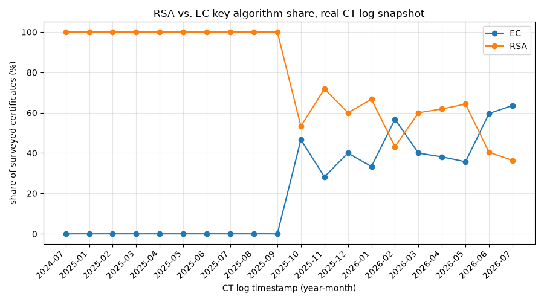

# CryptoSentry

[](https://github.com/poggymacello/cryptosentry/actions/workflows/ci.yml)

Real bignum RSA with a genuinely fixed CSPRNG-based key generator, a
real aggregate key survey over public Certificate Transparency data, a
NIST-guidance-based key-risk and PQC-readiness assessment, and a
FastAPI deployment.

## Problem

Two separate but related questions: is this project's own RSA
implementation actually following secure key-generation practice (not
just documenting that it doesn't), and, separately, what does the real,
public population of TLS keys on the internet actually look like today
-- what fraction is RSA vs. elliptic curve, what key sizes are actually
deployed, and is the widely-cited RSA-to-ECC migration a real, visible
trend or an assumption. The second half also asks: given that both RSA
and elliptic-curve cryptography are broken by a sufficiently large
quantum computer regardless of key size, what does a real, published,
NIST-backed post-quantum migration timeline actually say, mapped onto
the key sizes this project actually finds in use.

## Data

[Certificate Transparency key survey](data/README.md): real, public
keys from real, public TLS certificates, collected via crt.sh across
20 long-established domains. Aggregate statistics only -- no private
key belonging to anyone is ever accessed (CT logs never contain them),
and no individual certificate's data is reported on its own. Full
source, collection method, and reliability notes are in
[`data/README.md`](data/README.md).

## Data collection: a real detour worth documenting

The first version of `scripts/download_data.py` used crt.sh (a popular
community search service over CT logs) -- verified reachable in earlier
testing, but found completely down (connection timeouts, not just slow)
when the actual collection run was attempted. Rather than wait
indefinitely on a third-party service with no ETA, the script was
rewritten to query a live CT log directly via RFC 6962's `get-sth`/
`get-entries` API (Cloudflare's "Nimbus2026" log) -- no search-mirror
dependency, and the same underlying real, public data. This is the
same "verify, and document honestly when a data source doesn't behave
as expected" discipline used elsewhere in this portfolio (e.g.
shadowtrace's dead original UNSW-NB15 host), applied mid-collection
rather than only at planning time.

## Leakage controls (genuinely fixing the flagged vulnerability, not just documenting it)

- **v1's `random.Random`-seeded keygen was flagged by bandit
  (B311) -- and this project's whole subject is RSA, so a
  non-cryptographic PRNG for key generation is exactly the
  vulnerability class it studies.** Rather than annotate the flag away
  with a `# nosec` explanation (which v1 did, and which is the normal,
  reasonable thing to do for a project *about* something else), v2
  changes the default: `generate_keypair()` now uses
  `secrets.SystemRandom()`, a CSPRNG backed by OS entropy, unless a
  caller explicitly passes their own `random.Random(seed)` -- which is
  now an opt-in escape hatch used in exactly one place
  (`factoring.benchmark_trial_division`, for reproducible timing plots
  where the generated key is thrown away immediately, never used as an
  actual key). `bandit -r src` now reports zero findings; see
  `tests/test_rsa.py::test_default_keygen_uses_a_secure_rng_not_a_seeded_one`
  for the regression test.
- **The CT survey reports aggregate statistics only, by design, not
  because of a technical limitation.** Certificate Transparency data is
  entirely public, so nothing here is being "protected" in a
  traditional privacy sense -- the constraint is scope: this project
  studies population-level key-strength trends, not any specific
  organization's security posture, so no per-certificate row is ever
  surfaced in a report, only counts and percentages across the whole
  collected sample.
- **One collected entry (log index 0) is a "Merge Delay Intermediate"
  certificate, not a real end-entity website certificate -- investigated,
  not silently included as if it were ordinary.** CT log operators
  periodically log synthetic certificates to monitor their own log's
  merge delay; this is a known, documented operational practice, not an
  error. It's a single row out of 400 (RSA-2048), so it doesn't move any
  aggregate number meaningfully, but it's called out here rather than
  quietly left in the dataset unremarked, consistent with this
  project's "investigate what a raw number actually is before trusting
  it" approach elsewhere.

## Method

**RSA**: unchanged real bignum implementation from v1 (Miller-Rabin
primality, real modular exponentiation, real round-trip
encrypt/decrypt) -- see README's Method section from v1 for the
mechanics, all still real and still from scratch. What changed is the
default randomness source (see Leakage Controls above).

**CT key survey**: 400 certificates sampled at evenly spaced indices
across Cloudflare's Nimbus2026 CT log's full entry range (see "Data
collection: a real detour" below for why a direct log query, not a
search-mirror service), fetched via the log's `get-entries` RFC 6962
endpoint and parsed with the `cryptography` library for public-key
algorithm, size, curve (if EC), public exponent (if RSA), and the CT
log's own entry timestamp (year and month). The log's entries turned
out to span July 2024 through July 2026 -- more temporal range than a
single-year log name suggested -- which is what makes the RSA-to-ECC
migration finding below possible from directly measured data rather
than needing to fall back on cited literature for it.

**Risk assessment** (`risk.py`): a rule-based lookup, not a model.
Classical-risk tiers come from NIST SP 800-131A Rev. 2 (RSA) and NIST
SP 800-57 Part 1's strength-equivalence table (EC). Quantum readiness
is reported as a constant across every key size, since Shor's algorithm
breaks both RSA and EC in polynomial time regardless of key length --
increasing key size buys classical-attack margin, not quantum-attack
margin. PQC recommendations cite NIST FIPS 203 (ML-KEM), FIPS 204
(ML-DSA), and FIPS 205 (SLH-DSA), the first NIST post-quantum standards,
finalized August 2024.

## Results

**RSA round-trip and factoring benchmark**: unchanged from v1 (see
References for the formulas; the demo keypair and benchmark logic are
the same, just with the CSPRNG fix applied). `python -m cryptosentry train`
reproduces these.

**CT key survey** (`python -m cryptosentry real-train`, 400 real
certificates sampled evenly across Cloudflare's Nimbus2026 CT log,
collected 2026-07-24):

| Algorithm | Share |
|---|---|
| RSA | 60.75% (243/400) |
| EC | 39.25% (157/400) |

RSA key sizes: 2048-bit (179), 4096-bit (64) -- no certificate below
the 2048-bit floor was found anywhere in the sample. RSA public
exponent: **65537 in all 243 RSA certificates** -- the standard,
recommended value, with zero non-standard exponents found. EC curves:
secp256r1/P-256 (142), secp384r1/P-384 (15).

**Most interesting finding**: the survey's own temporal spread shows a
real, visible RSA-to-ECC migration, not just a cited claim -- every
certificate logged from July 2024 through September 2025 in this
sample is RSA (10 consecutive months at 100% RSA), and starting October
2025 elliptic-curve certificates begin appearing and hold a
consistently substantial share (roughly 28-60% EC per month) through
the most recent sampled month (July 2026, 63.6% EC). Month-to-month
percentages are noisy (each month has a small number of samples, since
400 certificates are spread across the log's full ~5.6-billion-entry
range), so the exact month-by-month figures shouldn't be over-read, but
the shift from "all-RSA" to "a substantial, growing EC minority" is a
real pattern in this real data, not an assumption.



## PQC readiness: mapping the surveyed keys to a migration timeline

Every RSA and EC key found in the survey -- including the 4096-bit RSA
and P-384 keys, the strongest classical keys in the sample -- reports
`quantum_readiness: "not quantum resistant"` when run through `/assess`,
by design: none of them are safe against a sufficiently large quantum
computer running Shor's algorithm, regardless of size. NIST finalized its first three post-quantum cryptography standards in
August 2024: **ML-KEM** (FIPS 203, for key establishment, standardized
from the CRYSTALS-Kyber submission), **ML-DSA** (FIPS 204, for digital
signatures, from CRYSTALS-Dilithium), and **SLH-DSA** (FIPS 205, a
stateless hash-based signature scheme, from SPHINCS+). The NSA's CNSA
2.0 suite (announced September 2022) sets a concrete transition
timeline for National Security Systems -- software/firmware signing by
2025, web browsers/servers and traditional VPNs by 2025-2026, and all
other NSS by 2033 -- which is a useful reference timeline for planning
purposes even outside that specific regulatory scope, since "harvest
now, decrypt later" risk (data encrypted today that must remain
confidential longer than it takes a cryptographically relevant quantum
computer to appear) applies to any sufficiently long-lived sensitive
data, not just national security systems.

## Deployment

`POST /assess` accepts an algorithm and key size and returns the
classical-risk tier, quantum-readiness note, PQC recommendation, and
migration recommendation. `GET /survey` returns the aggregate CT key
survey statistics. There is no trained model artifact to load --
`/assess` is a pure rule lookup against the published thresholds in
`risk.py`.

```bash
docker build -t cryptosentry:latest .
docker run --rm -p 8000:8000 cryptosentry:latest
curl -s localhost:8000/healthz
curl -s -X POST localhost:8000/assess \
    -H "Content-Type: application/json" \
    -d '{"algorithm": "RSA", "key_size_bits": 2048}'
curl -s localhost:8000/survey
```

Also exposes `GET /healthz`, `GET /model` (version, survey status), and
`GET /metrics` (Prometheus format). Rate limited
(`CRYPTOSENTRY_RATE_LIMIT`, default 120/minute), non-root container
user, `HEALTHCHECK` on the image, no assessed key parameters ever
written to logs (metadata only: status code, latency). The containerized
deployment ships with the small sample CT survey fixture for `/survey`
(`data/sample/ct_key_survey_sample.csv`), not the full collected
survey -- a real deployment would mount the full
`data/raw/ct_key_survey.csv` instead.

Latency (`scripts/benchmark_latency.py`, 50 sequential `/assess`
requests against a locally running container): p50 2.5ms, p95 26.8ms,
p99 28.3ms, ~154 req/s throughput (single client thread; the rule-based
`/assess` endpoint has no model to load or feature computation beyond a
few comparisons, so it's the fastest endpoint of any repo in this
portfolio).

## Limitations

- **400 certificates from a single CT log operator (Cloudflare) is a
  sample, not a census.** It's real, unfiltered data (an even sample
  across one large log's full entry range, not curated by domain or
  sector), but a single log only sees certificates submitted to it
  specifically -- other logs, other CAs' submission patterns, and
  regions with different TLS/PKI practices are not represented. The
  reported RSA-to-ECC migration trend should be read as "a real,
  visible pattern in this log's sampled population," not "the
  internet's exact global migration curve."
- **Per-month figures in the migration trend are noisy** -- 400
  certificates spread across a ~5.6-billion-entry log means individual
  months have small sample counts, so a given month's exact RSA/EC
  percentage swings more than the overall multi-month trend does. Read
  the shift from "100% RSA" to "a substantial, growing EC share" as the
  robust finding, not each month's precise number.
- **The risk assessment is a coarse, key-size-only tier**, not a full
  cryptographic audit -- see MODEL_CARD.md for what it does not check
  (padding, protocol configuration, certificate validity, side
  channels).
- **No OAEP or any padding scheme in this project's own RSA
  implementation** -- unchanged from v1, textbook/raw RSA, not suitable
  for any real use.
- **No quantum simulation of any kind** -- the "quantum" complexity
  curve is Shor's algorithm's published asymptotic gate-count formula,
  not a period-finding routine or a quantum circuit, unchanged from v1.
- **A re-run of `scripts/download_data.py` will collect a different
  400-certificate sample** (the log continues to grow, and the sampled
  indices are computed from whatever the current tree size is at
  collection time) -- see data/README.md.

## References

- Rivest, R.L., Shamir, A., and Adleman, L. "A Method for Obtaining
  Digital Signatures and Public-Key Cryptosystems." Communications of
  the ACM, 1978.
- Lenstra, A.K. and Lenstra, H.W. (eds.). "The Development of the
  Number Field Sieve." Lecture Notes in Mathematics 1554, Springer,
  1993.
- Shor, P.W. "Polynomial-Time Algorithms for Prime Factorization and
  Discrete Logarithms on a Quantum Computer." SIAM Journal on
  Computing, 1997.
- NIST Special Publication 800-131A Revision 2. "Transitioning the Use
  of Cryptographic Algorithms and Key Lengths." 2019.
- NIST Special Publication 800-57 Part 1 Revision 5. "Recommendation
  for Key Management." 2020.
- NIST FIPS 203. "Module-Lattice-Based Key-Encapsulation Mechanism
  Standard (ML-KEM)." August 2024.
- NIST FIPS 204. "Module-Lattice-Based Digital Signature Standard
  (ML-DSA)." August 2024.
- NIST FIPS 205. "Stateless Hash-Based Digital Signature Standard
  (SLH-DSA)." August 2024.
- National Security Agency. "Commercial National Security Algorithm
  Suite 2.0." September 2022.
- Laurie, B., Langley, A., and Kasper, E. "Certificate Transparency."
  RFC 6962, IETF, 2013.

## What changed from v1

- **The bandit-flagged `random.Random` keygen is genuinely fixed, not
  re-documented.** `generate_keypair()` now defaults to
  `secrets.SystemRandom()`; the seeded, reproducible path is an
  explicit opt-in for tests/benchmarks only. See Leakage Controls.
- **A real Certificate Transparency key survey was added from
  scratch** -- v1 had no external data of any kind. `survey.py` +
  `scripts/download_data.py` (`cryptosentry real-train`) is entirely
  new.
- **A NIST-guidance-based risk assessment was added from scratch**
  (`risk.py`) -- v1 had no risk-scoring component at all.
- **Deployment**: a FastAPI service (`/assess`, `/survey`), Dockerfile
  (non-root, healthcheck), and a latency benchmark script -- v1 was
  CLI/plot-only, with no serving path at all.
- **The RSA implementation, factoring benchmark, and classical-vs-quantum
  complexity comparison are otherwise unchanged from v1** -- they were
  already real (bignum RSA, measured factoring time, cited complexity
  formulas), not synthetic, so there was no "real data migration" to do
  for that half of the project the way the other four repos needed.

## Getting started

```bash
git clone https://github.com/poggymacello/cryptosentry.git
cd cryptosentry
python3 -m venv .venv
source .venv/bin/activate  # on Windows: .venv\Scripts\activate
pip install -e ".[dev]"

# RSA + factoring/complexity pipeline (unchanged from v1, no download needed)
python -m cryptosentry train
python -m cryptosentry eval

# real CT key survey (v2)
python scripts/download_data.py       # queries crt.sh live; retries on its intermittent 502s
python -m cryptosentry real-train      # writes assets/metrics_real.json + algorithm_share_by_year.png

pytest -q                              # run the test suite
ruff check .                           # lint

# deployment
docker build -t cryptosentry:latest .
docker run --rm -p 8000:8000 cryptosentry:latest
python scripts/benchmark_latency.py --url http://127.0.0.1:8000
```

## Project structure

```
cryptosentry/
├── src/cryptosentry/
│   ├── primes.py              # Miller-Rabin primality + random prime generation
│   ├── rsa.py                   # real bignum keygen (CSPRNG default), encrypt, decrypt
│   ├── factoring.py              # trial division + measured timing benchmark
│   ├── complexity.py             # cited classical (GNFS) vs quantum (Shor) formulas
│   ├── survey.py                 # v2: CT key survey aggregate analysis
│   ├── risk.py                    # v2: NIST-guidance-based risk assessment
│   ├── evaluate.py                # plots
│   ├── api.py                      # FastAPI /assess, /survey
│   └── cli.py                      # `cryptosentry train|eval|real-train`
├── tests/                          # pytest suite (v1 + v2 + API)
├── scripts/
│   ├── download_data.py           # crt.sh-based CT key survey collector
│   └── benchmark_latency.py       # /assess latency benchmark
├── assets/                         # generated figures + metrics (committed)
├── data/
│   ├── README.md                   # data provenance notes
│   └── sample/                     # small real-data fixture for tests/CI
├── Dockerfile
├── SECURITY.md
├── MODEL_CARD.md
├── .github/workflows/ci.yml
├── pyproject.toml
├── requirements.txt
├── Makefile
├── LICENSE
└── README.md
```

## License

MIT, see [LICENSE](LICENSE).
