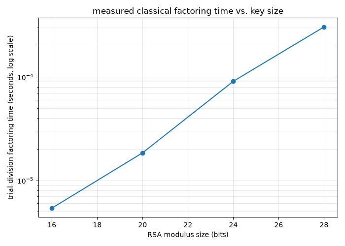
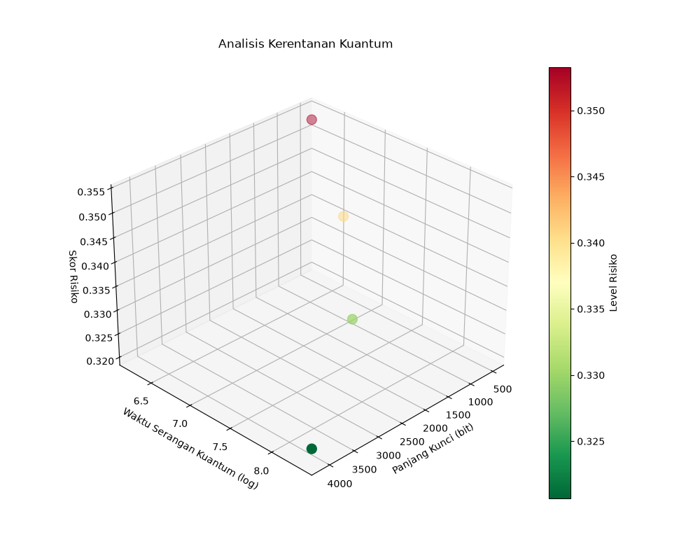

# CryptoSentry

[](https://github.com/poggymacello/cryptosentry/actions/workflows/ci.yml)

**Toy-parameter keys, generated on the fly — not production cryptography (see Limitations).** For a version of this portfolio built on a real, labeled dataset with a deployed inference service, see [shadowtrace](https://github.com/poggymacello/shadowtrace).

Real bignum RSA, plus an honest classical-vs-quantum factoring complexity comparison, for educational use.

## Problem

RSA's security rests on integer factorization being hard for classical computers, and Shor's algorithm is the textbook reason a sufficiently large quantum computer would break that assumption. An earlier version of this project called itself a Shor's-algorithm simulation while actually doing classical trial division and reporting `log(n)` as a stand-in — which is a misleading thing to say out loud in an interview. This version does two things it can actually back up: real RSA (real random bignum primes, real modular exponentiation, real round-trip encryption), and a comparison of the *published* classical vs. quantum complexity formulas, clearly labeled as a citation-backed theoretical estimate rather than a simulation of either algorithm.

## Approach

RSA keygen, encryption, and decryption are implemented from scratch over Python's arbitrary-precision integers, with correctness verified by round-trip tests. Classical factoring cost is measured directly (real wall-clock trial division at small key sizes, where it's actually tractable). Classical-vs-quantum cost at real-world key sizes (where neither algorithm is actually runnable on a laptop) uses the well-known asymptotic formulas from the literature.

## Data

No external dataset. Keypairs are generated on demand; see [`data/README.md`](data/README.md).

## Method

- **Primality**: Miller-Rabin, implemented from scratch (`src/cryptosentry/primes.py`), 20 rounds (false-positive probability ≤ 4⁻²⁰).
- **Keygen**: two random `bits // 2`-bit primes, public exponent 65537, private exponent via the extended Euclidean algorithm (`src/cryptosentry/rsa.py`). Default demo key is a real 255-256 bit modulus — nowhere near production-strength (2048+ bits), but a genuine randomly generated bignum key, not a hardcoded pair of small primes.
- **Encrypt/decrypt**: raw ("textbook") RSA, `pow(m, e, n)` and `pow(c, d, n)`. No OAEP padding — see Limitations.
- **Classical factoring, measured**: trial division, benchmarked at 16/20/24/28-bit moduli, where it actually finishes in reasonable time. This is real wall-clock timing, not an estimate.
- **Classical vs. quantum, cited**: General Number Field Sieve (best known classical algorithm) vs. Shor's algorithm gate-count, both textbook asymptotic formulas (see References), plotted across 16 to 2048-bit moduli. **This does not run either algorithm** — GNFS and Shor's algorithm are both far beyond what this project implements; the plot shows the published formulas' shapes, not a simulation.

## Results

Trial-division factoring time, measured directly (seed 42):

| Modulus size | Time |
|---|---|
| 16 bits | 5 μs |
| 20 bits | 19 μs |
| 24 bits | 91 μs |
| 28 bits | 304 μs |



Time roughly quadruples every 4 bits, consistent with trial division's O(√N) complexity (√N doubles roughly every 2 bits, so ~4x every 4 bits) — a real, measured exponential curve on a log-scale y-axis, not an assumption.



At small sizes the two curves are close; by real-world key sizes (1024-2048 bits) they diverge by roughly 20+ orders of magnitude — GNFS's estimated operation count grows sub-exponentially, while Shor's estimated gate count grows only polynomially (cubic in the bit length). This is the standard, textbook argument for why sufficiently large quantum computers threaten RSA and why classical brute-force factoring doesn't scale, illustrated with the actual formulas rather than asserted.

## Limitations

- No OAEP or any padding scheme — this is textbook RSA, vulnerable to the well-known attacks padding exists to prevent (and, concretely in this codebase, unable to distinguish a message from the same message with leading zero bytes stripped — see `rsa.decrypt`'s docstring and `test_leading_zero_bytes_are_not_preserved`).
- No quantum simulation of any kind. The "quantum" curve is Shor's algorithm's published asymptotic gate-count formula, not a period-finding routine or a quantum circuit.
- Trial division is only benchmarked up to 28 bits; it is not feasible to run at production key sizes, which is exactly why the large-key comparison uses cited formulas instead of measurement.
- 255-256 bit keys are convenient for a fast demo and nowhere close to secure; production RSA uses 2048+ bit moduli.
- **Key generation uses Python's `random.Random` (a Mersenne Twister PRNG), not a cryptographically secure random number generator.** This is deliberate here — it's what makes `generate_keypair(seed=...)` reproducible for tests and demos — but it is a real, well-known class of RSA vulnerability in practice (predictable or low-entropy randomness has caused real-world weak/duplicate RSA keys). Production RSA key generation must use a CSPRNG (e.g., `secrets`, or the OS's `/dev/urandom`), never a seeded PRNG. `bandit` flags both call sites in this codebase (`primes.py`, `rsa.py`) for exactly this reason; they're annotated `# nosec` with this rationale rather than silenced without explanation.

## References

- Rivest, R.L., Shamir, A., and Adleman, L. "A Method for Obtaining Digital Signatures and Public-Key Cryptosystems." Communications of the ACM, 1978.
- Lenstra, A.K. and Lenstra, H.W. (eds.). "The Development of the Number Field Sieve." Lecture Notes in Mathematics 1554, Springer, 1993.
- Shor, P.W. "Polynomial-Time Algorithms for Prime Factorization and Discrete Logarithms on a Quantum Computer." SIAM Journal on Computing, 1997.

## Getting started

```bash
git clone https://github.com/poggymacello/cryptosentry.git
cd cryptosentry
python3 -m venv .venv
source .venv/bin/activate  # on Windows: .venv\Scripts\activate
pip install -e ".[dev]"
python -m cryptosentry train     # keygen + round-trip check + benchmark, writes assets/
python -m cryptosentry eval      # re-runs the deterministic pipeline and prints results
pytest -q                        # run the test suite (includes required round-trip tests)
ruff check .                     # lint
```

## Project structure

```
cryptosentry/
├── src/cryptosentry/
│   ├── primes.py           # Miller-Rabin primality test + random prime generation
│   ├── rsa.py                # real bignum keygen, encrypt, decrypt
│   ├── factoring.py           # trial division + measured timing benchmark
│   ├── complexity.py          # cited classical (GNFS) vs quantum (Shor) formulas — not a simulation
│   ├── evaluate.py            # plots
│   └── cli.py                  # `cryptosentry train` / `cryptosentry eval`
├── tests/                      # pytest suite, including RSA round-trip tests
├── assets/                     # generated figures + metrics.json (committed)
├── data/README.md              # data provenance notes
├── .github/workflows/ci.yml
├── pyproject.toml
├── requirements.txt
├── Makefile
├── LICENSE
└── README.md
```

## License

MIT, see [LICENSE](LICENSE).
